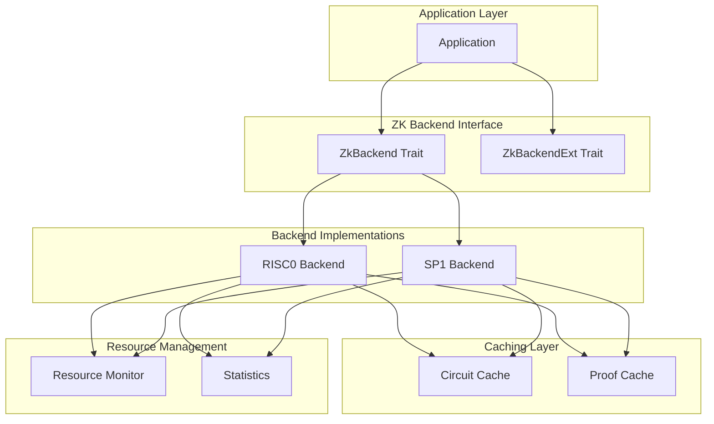
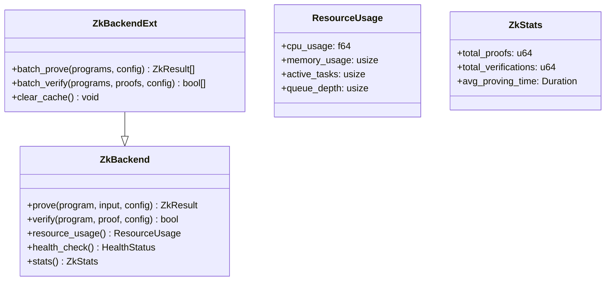
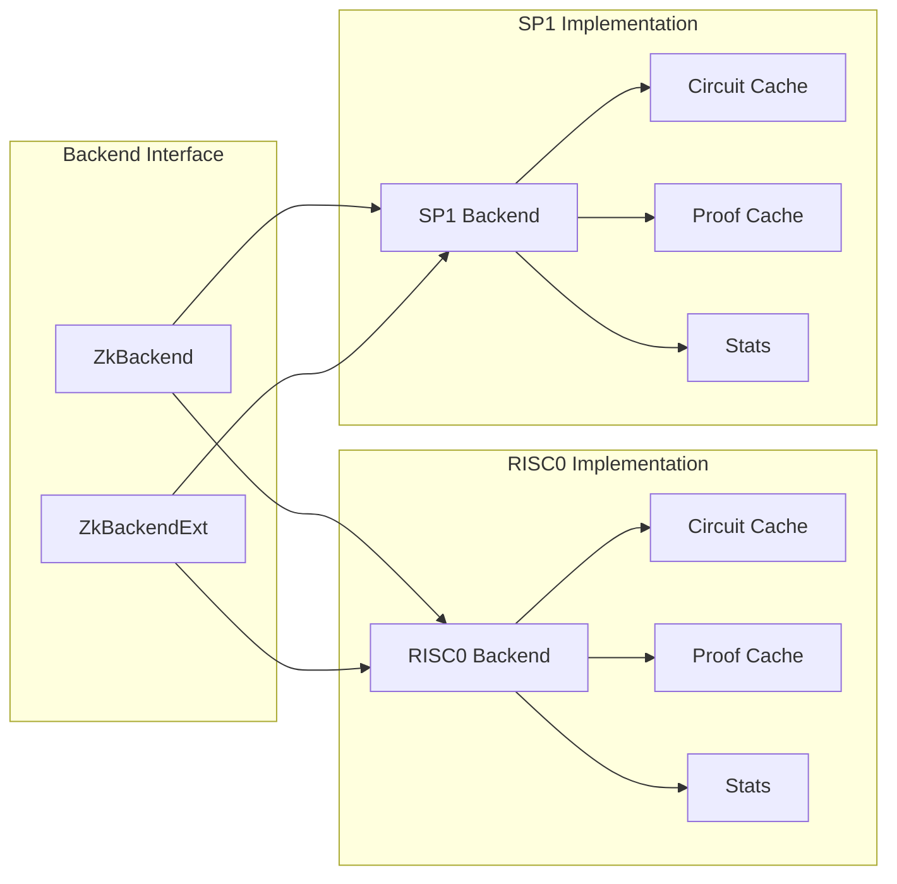
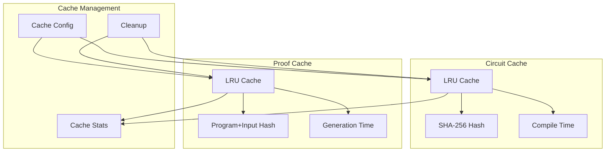
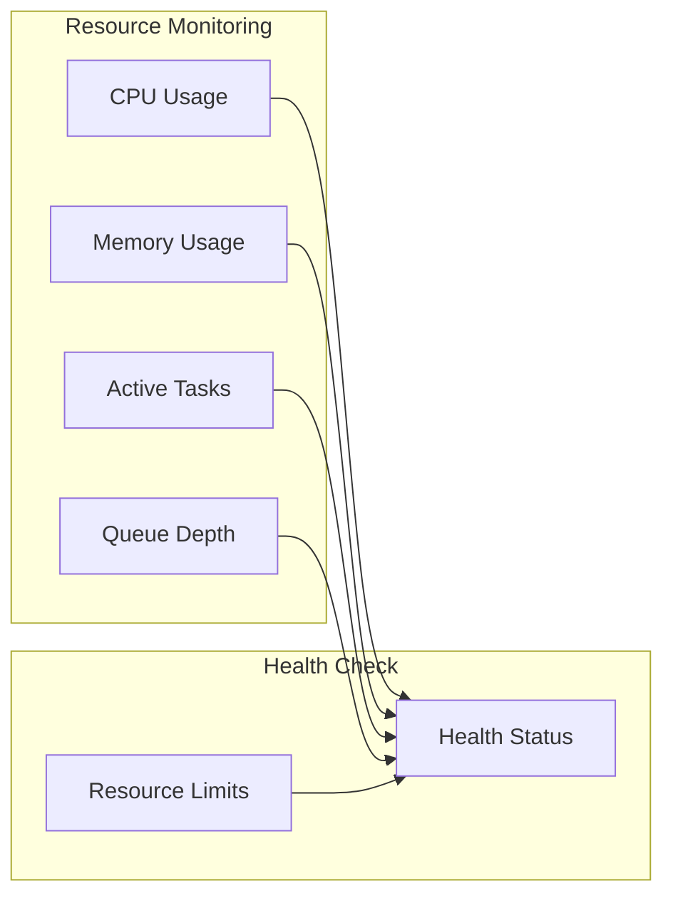
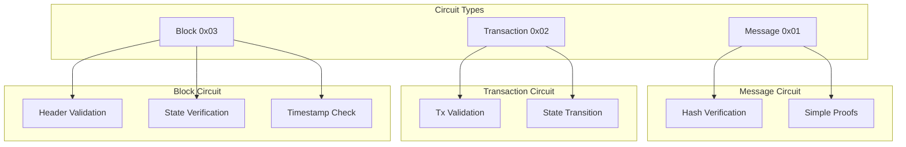

# Frostgate ZK Backend Design

This document describes the current design of Frostgate's zero-knowledge proof backend system.

## Architecture Overview

The ZK backend system is designed with modularity, performance, and extensibility in mind. It consists of multiple layers:



### 1. Core Traits and Types

- `ZkBackend`: Core trait defining the basic proving and verification interface
- `ZkBackendExt`: Extended trait for advanced features like batch operations
- Common types for configuration, statistics, and resource tracking



### 2. Backend Implementations



#### RISC0 Backend
- Supports message, transaction, and block verification circuits
- Implements circuit and proof caching
- Provides parallel batch operations
- Tracks resource usage and performance statistics

#### SP1 Backend
- Mirrors RISC0 functionality for compatibility
- Optimized for SP1's specific proving system
- Shares common interface and caching mechanisms

### 3. Caching System



Both backends implement a two-level caching system:
- Thread-safe using RwLock
- Configurable cache sizes and TTL
- Statistics tracking
- Automatic cleanup of expired entries

### 4. Resource Management



### 5. Circuit Types



Three standardized circuit types:
1. Message Verification (0x01)
   - Basic message and hash verification
   - Used for simple proofs

2. Transaction Verification (0x02)
   - Transaction validation
   - State transition verification

3. Block Verification (0x03)
   - Block header validation
   - Chain state verification
   - Timestamp and gas checks

## Performance Optimizations

1. Circuit Caching
   - Compiled circuits are cached
   - Significant speedup for repeated operations
   - Configurable cache size and TTL

2. Proof Caching
   - Generated proofs are cached
   - Near-instant response for identical requests
   - Automatic cache invalidation

3. Parallel Processing
   - Batch operations use rayon
   - Configurable thread pool size
   - Resource-aware scheduling

## Configuration Options

```rust
struct CacheConfig {
    max_circuits: usize,
    max_proofs: usize,
    max_age: Duration,
    enable_proof_cache: bool,
}

struct BackendOptions {
    num_threads: Option<usize>,
    memory_limit: Option<usize>,
    prover_opts: Option<ProverOpts>,
}
```

## Statistics and Monitoring

The system tracks:
- Proof generation times
- Verification times
- Cache hit rates
- Resource utilization
- Success/failure rates

## Error Handling

Comprehensive error handling for:
- Invalid inputs
- Resource exhaustion
- Circuit compilation failures
- Proof generation errors
- Verification failures

## Security Considerations

1. Input Validation
   - All inputs are validated before processing
   - Circuit-specific validation rules
   - Hash verification for integrity

2. Resource Limits
   - Configurable memory limits
   - CPU usage monitoring
   - Queue depth control

3. Cache Security
   - Automatic expiration
   - Size limits
   - No sensitive data in cache

## Future Extensions

The design allows for:
1. Additional circuit types
2. New backend implementations
3. Enhanced caching strategies
4. Advanced batching optimizations
5. Custom circuit compilation 