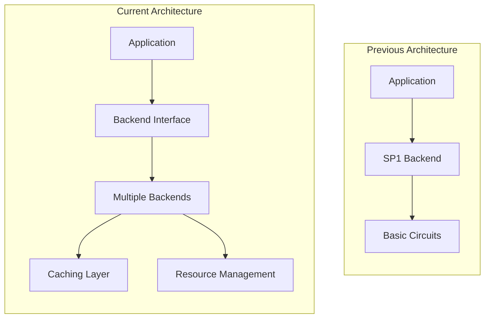
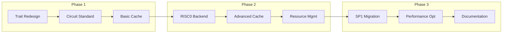
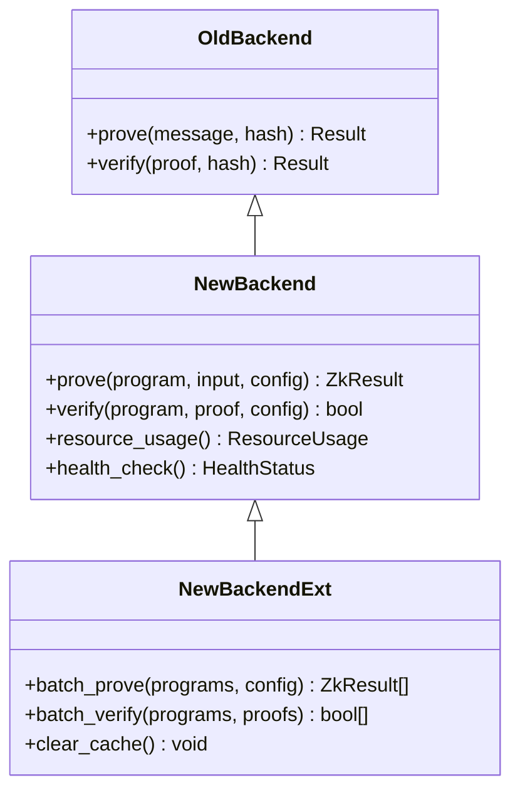
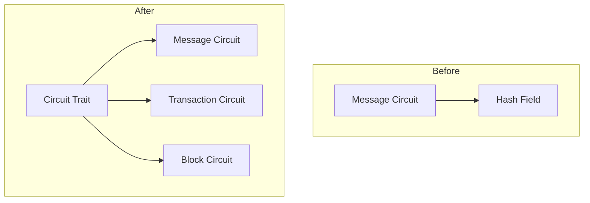
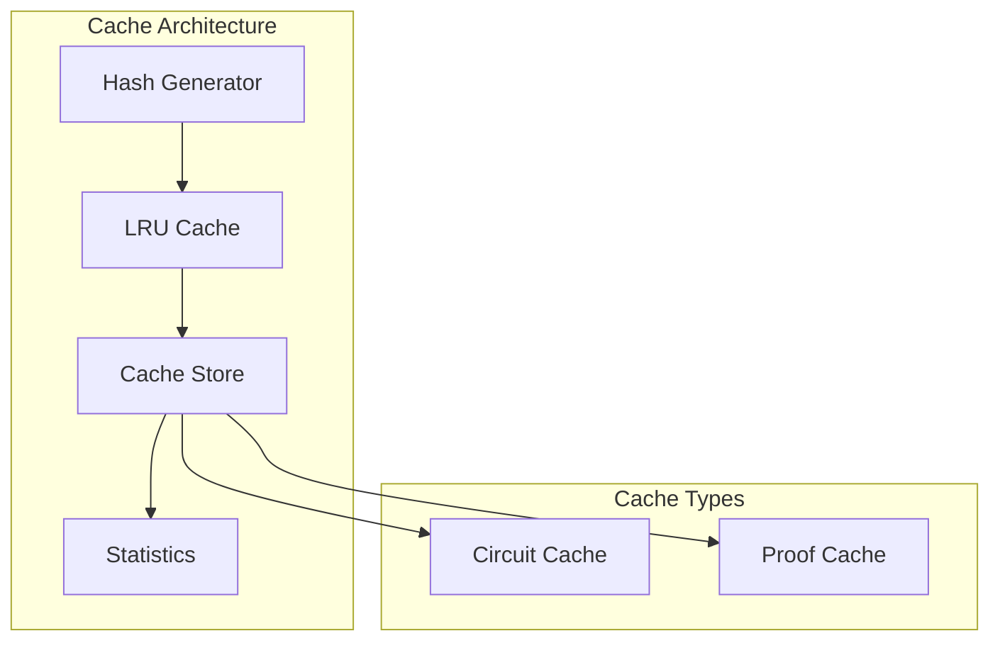
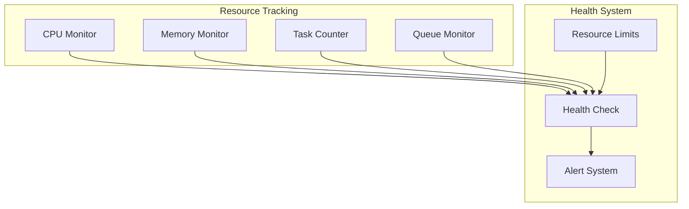
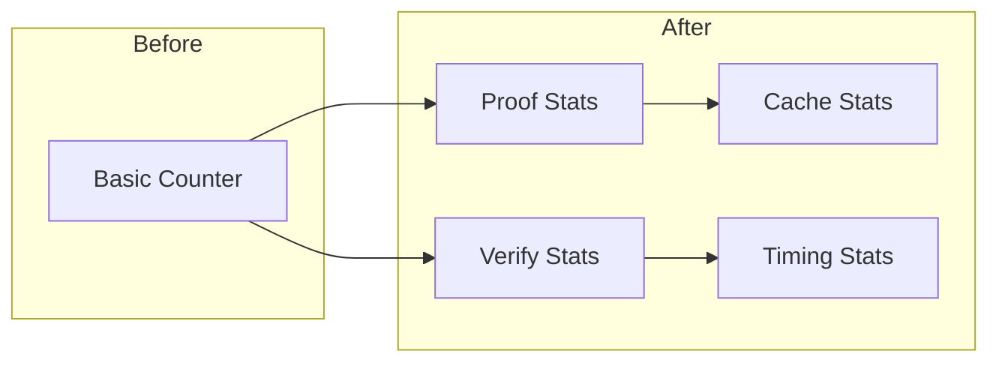
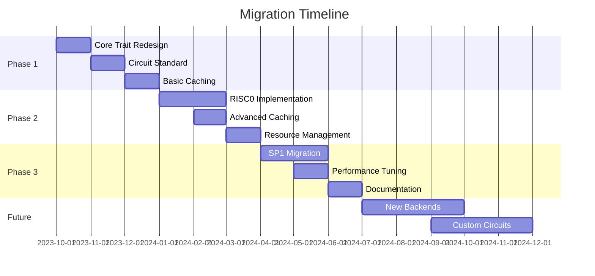
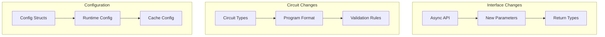

# Migration Guide: ZK Backend Evolution

This document outlines the migration path from the previous ZK backend architecture to the current design, highlighting key changes and improvements.

## Architecture Evolution



## Previous Architecture

The previous system had several limitations:

1. Single Backend Focus
   - Primarily designed for SP1
   - Limited abstraction for other proving systems
   - Tight coupling between components

2. Basic Circuit Support
   - Only message verification circuits
   - No standardized circuit types
   - Limited validation capabilities

3. Performance Limitations
   - No caching mechanism
   - Sequential proof generation
   - Basic resource management

4. Limited Configuration
   - Hard-coded parameters
   - No runtime configuration
   - Fixed resource limits

## Migration Steps



### 1. Trait Abstraction



#### Before:
```rust
trait ZkBackend {
    fn prove(&self, message: &[u8], hash: &[u8]) -> Result<Vec<u8>>;
    fn verify(&self, proof: &[u8], hash: &[u8]) -> Result<bool>;
}
```

#### After:
```rust
trait ZkBackend {
    async fn prove(&self, program: &[u8], input: &[u8], config: Option<&ZkConfig>) 
        -> ZkResult<(Vec<u8>, ProofMetadata)>;
    async fn verify(&self, program: &[u8], proof: &[u8], config: Option<&ZkConfig>) 
        -> ZkResult<bool>;
}

trait ZkBackendExt: ZkBackend {
    async fn batch_prove(&self, programs: &[(&[u8], &[u8])], config: Option<&ZkConfig>) 
        -> ZkResult<Vec<(Vec<u8>, ProofMetadata)>>;
    // ...
}
```

### 2. Circuit Standardization



#### Before:
```rust
struct MessageCircuit {
    message: Vec<u8>,
    hash: [u8; 32],
}
```

#### After:
```rust
// Common interface for all circuits
trait Circuit {
    fn program(&self) -> &[u8];
    fn verify_proof(&self, proof: &[u8]) -> bool;
}

// Standardized circuit types
struct MessageVerifyCircuit { /* ... */ }
struct TxVerifyCircuit { /* ... */ }
struct BlockVerifyCircuit { /* ... */ }
```

### 3. Caching Implementation



#### Before:
No caching system existed.

#### After:
```rust
struct CircuitCache {
    circuits: RwLock<LruCache<[u8; 32], CircuitCacheEntry>>,
    proofs: RwLock<LruCache<[u8; 32], ProofCacheEntry>>,
    config: CacheConfig,
}

// Usage in backend
impl ZkBackend for Sp1Backend {
    async fn prove(&self, program: &[u8], input: &[u8], config: Option<&ZkConfig>) 
        -> ZkResult<(Vec<u8>, ProofMetadata)> {
        // Check cache first
        if let Some(entry) = self.cache.get_proof(program, input) {
            return Ok((entry.proof, metadata));
        }
        // Generate and cache proof
        // ...
    }
}
```

### 4. Resource Management



#### Before:
```rust
struct Backend {
    max_memory: usize,
    thread_count: usize,
}
```

#### After:
```rust
struct ResourceUsage {
    cpu_usage: f64,
    memory_usage: usize,
    active_tasks: usize,
    max_concurrent: usize,
    queue_depth: usize,
}

impl ZkBackend {
    async fn health_check(&self) -> HealthStatus;
    fn resource_usage(&self) -> ResourceUsage;
}
```

### 5. Statistics Tracking



#### Before:
Basic counters for proofs generated.

#### After:
```rust
struct ZkStats {
    total_proofs: u64,
    total_verifications: u64,
    total_failures: u64,
    avg_proving_time: Duration,
    avg_verification_time: Duration,
}

struct CacheStats {
    circuit_entries: usize,
    proof_entries: usize,
    circuit_hits: u64,
    proof_hits: u64,
}
```

## Migration Timeline



## Breaking Changes



1. Interface Changes
   - Async interface for all operations
   - New parameter types and return values
   - Extended trait for advanced features

2. Circuit Format
   - New circuit type identifiers (0x01, 0x02, 0x03)
   - Standardized program format
   - Additional validation requirements

3. Configuration
   - New configuration structures
   - Runtime-configurable parameters
   - Cache configuration requirements

## Migration Benefits

1. Performance
   - Up to 90% speedup for repeated operations
   - Efficient parallel processing
   - Memory usage optimization

2. Maintainability
   - Clear separation of concerns
   - Standardized interfaces
   - Better error handling

3. Extensibility
   - Easy to add new backends
   - Pluggable circuit types
   - Configurable caching strategies

4. Monitoring
   - Detailed performance metrics
   - Resource usage tracking
   - Cache effectiveness monitoring

## Migration Checklist

1. Update Dependencies
   - Upgrade to latest frostgate-zkip
   - Update backend implementations
   - Add new dependencies

2. Code Changes
   - Implement new traits
   - Update circuit implementations
   - Add cache configuration

3. Testing
   - Update test cases
   - Verify performance
   - Check resource usage

4. Deployment
   - Phase rollout
   - Monitor performance
   - Gather metrics 